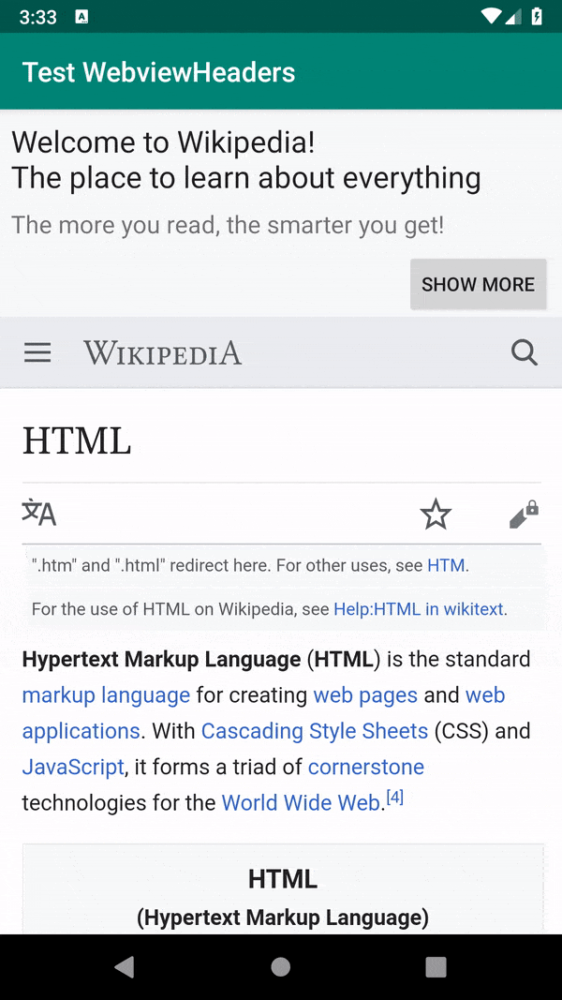

# webview-scrollable-headers
Webview that supports a native header which will scroll with the content.

This library allows you to easily add an header to your webview, 
where the header will scroll with the webview's content and remain constant across zoom in/out

The library tries to imitate the same solution Google done with Gmail's Email webview - which includes scrollable header

# Usage
Add the library to your project by importing it from jcenter:
```gradle
repositories {
    jcenter()
}

dependencies {
    implementation 'com.frucht:webview_scrollable_headers:1.0.0'
}
```

Use ScrollableHeaderWebView as your webview - in the relevant layout file.
Set the header layout you want to use with the webview.

Via Xml:
```xml
<com.frucht.webview_scrollable_headers.ScrollableHeaderWebView
        android:id="@+id/main_webview"
        android:layout_width="match_parent"
        android:layout_height="match_parent"
        scrollableHeaderWv:header_view="@layout/header"
        >
```

Via code:
```java
ScrollableHeaderWebView webview = findViewById(R.id.main_webview);
View header = getLayoutInflater().inflate(R.layout.header, webview, false);
webview.setHeaderView(header, ViewGroup.LayoutParams.MATCH_PARENT, ViewGroup.LayoutParams.WRAP_CONTENT);
```

**Note:** In order to put the header correctly above the web page, the webview automatically enables running javascript.
This should be taken into consideration when using the library - since it might introduce security issues into your app.
Disabling javascript though will break the library.

If you want to prevent javascript running in your content - load your relevant content (wether via url or actual html content) using iframe, while using "sandbox" attribute.

Reference: https://developer.mozilla.org/en-US/docs/Web/HTML/Element/iframe#Attributes

# Example
The result achieved - as can be seen in the demo app:


